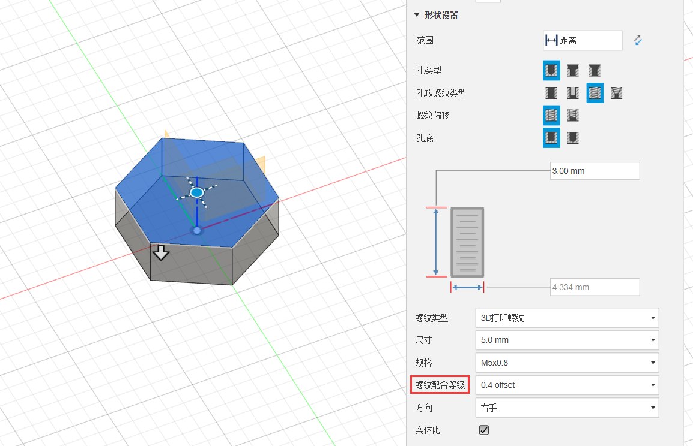

# fusion 360打印螺纹生成

1.将`CustomISOMetricprofile.xml` 复制到`C:\Users\用户名\AppData\Local\Autodesk\webdeploy\production\软件版本号\Fusion\Server\Fusion\Configuration\ThreadData\CustomISOMetricprofile.xml` 目录下

2.根据打印机精度设置螺纹的偏移值

